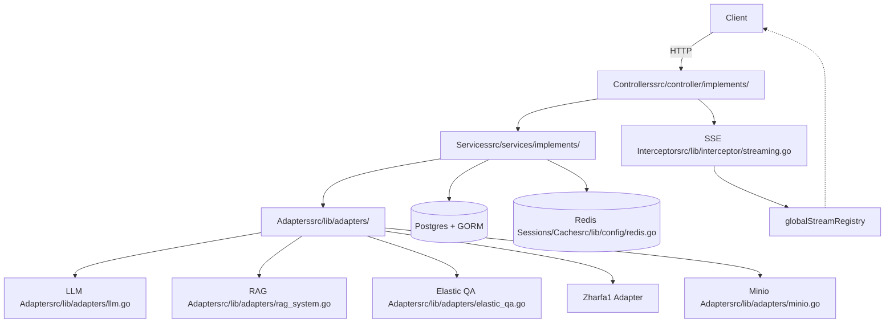
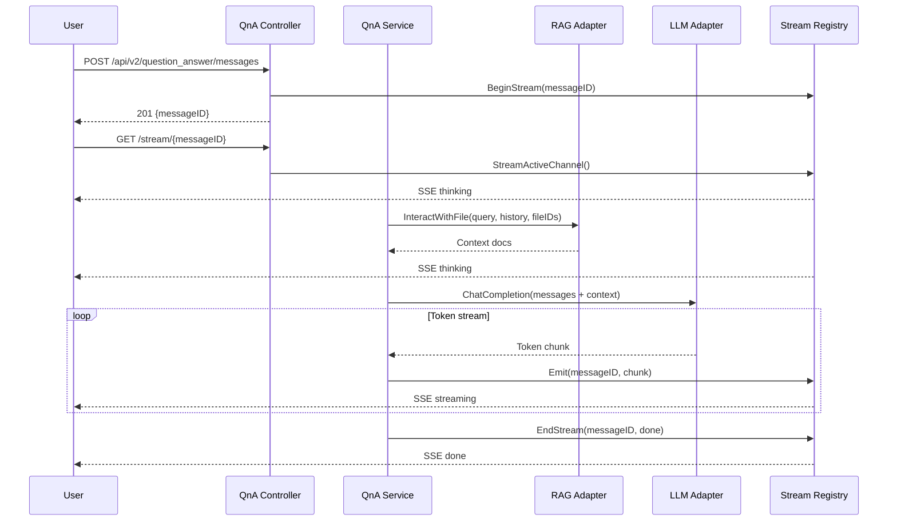
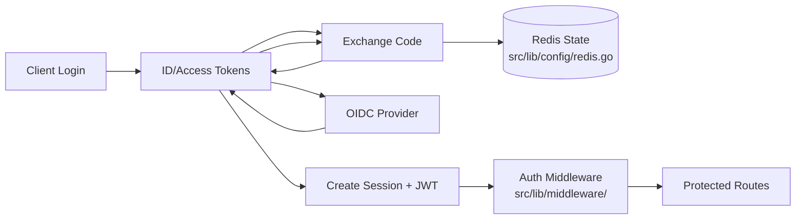
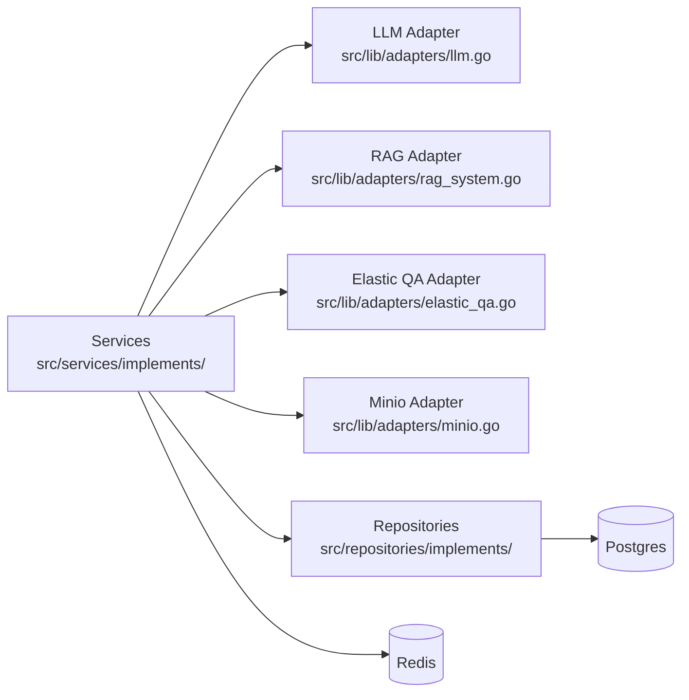
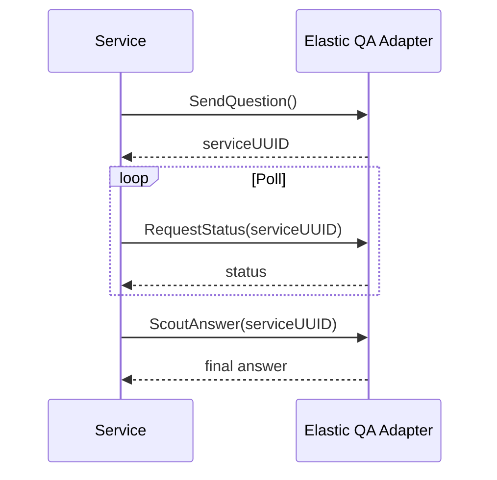
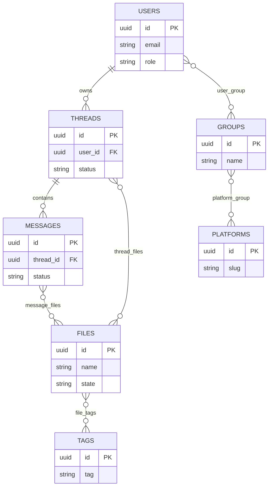

# Yggdrasil AI Gateway
## Technical Deep Dive for Engineers
- Go-based AI Service Orchestrator and unified proxy layer
- Six tools: Translate, Summarize, File-QA, DB-QA, Rahkar, Content-Creation
- RAG (Qdrant), LLM, Zharfa1 behind consistent REST + SSE streaming
- GORM-backed persistence, dual-auth (OIDC/JWT + Secret Key)
Notes:
- Say what Yggdrasil is and why it exists: a unified gateway for AI tools.
- Emphasize streaming and async for V2 endpoints.
- Point to real files: main.go for DI bootstrap, streaming.go for SSE.
- Takeaway: this is an orchestration layer with clear separation of concerns.
- Timing: 1:00
---
# Agenda
- Architecture & dependency injection
- Streaming & AI request flow
- Adapters & async DB-QA
- Failure scenarios & mitigations
- Performance, security, observability
- Testing, deployment, demo & runbook
Notes:
- Outline the flow of the session.
- Mention diagrams and troubleshooting focus.
- Highlight that we'll dive into real failure scenarios.
- Takeaway: practical engineering view, not product overview.
- Timing: 0:45
---
# Architecture Overview (DI Bus Pattern)
- Controller → Service → Repository with constructor injection
- Bootstrap in main.go:
  - repositories.NewRepositorys(db)
  - services.NewServices(repositoryBus)
  - controller.NewController(serviceBus)
- V1 sync vs V2 async (SSE) endpoint split
- Centralized config and middleware setup
Notes:
- Point to DI bootstrap in main.go for wiring.
- Note where routes are registered in controller.go.
- Emphasize the layering boundaries for maintainability.
- Takeaway: clear injection points = easy testing and swaps.
- Timing: 1:15
---
# System Architecture Diagram
Alt-text: System overview showing Controllers → Services → Adapters and data stores, with SSE interceptor and global stream registry.

Notes:
- Walk through the main flow left to right.
- Highlight where persistence and caching are accessed.
- Emphasize SSE as cross-cutting for V2.
- Takeaway: adapters isolate external dependencies.
- Timing: 1:30
---
# Request Lifecycle: V1 vs V2
- V1: synchronous, controller waits for service completion
- V2: async + SSE streaming for long-running AI calls
- V2 pattern: create message, BeginStream, goroutine, return message ID
- Client subscribes to /stream/{messageID}
Notes:
- Point to QnA V2 pattern and streaming.go.
- Mention immediate HTTP 201 in V2 with background work.
- Takeaway: V2 is resilient for long AI workflows.
- Timing: 1:00
---
# AI Request Flow (Question Answering)
Alt-text: Sequence of User → Controller → Service → RAG → LLM with streaming events and SSE registry.

Notes:
- Explain stream lifecycle and immediate response pattern.
- Mention that streaming.go manages channels and SSE events.
- Takeaway: decouples client responsiveness from AI latency.
- Timing: 1:30
---
# Streaming Registry Lifecycle
Alt-text: BeginStream creates channel, Emit writes tokens, StreamActiveChannel drains, EndStream closes and cleanup; clients may reconnect.
```mermaid
flowchart LR
  A[BeginStream(messageID)] --> B[Create buffered channel]
  B --> C[Emit token chunks]
  C --> D[StreamActiveChannel]
  D -->|SSE events| E[Client]
  D --> F[EndStream(done/error)]
  F --> G[Delete channel & cleanup]
  E -. reconnect .-> D
  E -. timeout .-> F
```
Notes:
- Highlight buffered channel sizing and backpressure concerns.
- Mention client disconnect handling via context cancellation.
- Takeaway: registry cleanup is essential to avoid leaks.
- Timing: 1:00
---
# Authentication Flow (OIDC + Redis + JWT)
Alt-text: OIDC login flow storing state in Redis, exchanging tokens, creating JWT/session, middleware validates on requests.

Notes:
- Call out state storage and replay protection in Redis.
- Emphasize dual-auth for service-to-service requests.
- Takeaway: OIDC is first-class, JWT used for API auth.
- Timing: 1:00
---
# Adapter Dependency Graph
Alt-text: Services depend on adapters and repositories; adapters integrate external systems.

Notes:
- Emphasize adapters are the swap boundary for external services.
- Mention tests can mock adapters for deterministic behavior.
- Takeaway: dependency graph is narrow and explicit.
- Timing: 0:50
---
# DB-QA Async Polling Pattern
Alt-text: DB-QA uses SendQuestion, RequestStatus polling, and ScoutAnswer for final output.

Notes:
- Mention backoff and idempotency tokens for safe polling.
- Point to src/lib/adapters/elastic_qa.go.
- Takeaway: async polling must be guarded against duplication.
- Timing: 0:50
---
# ERD (Simplified)
Alt-text: Core entities include Users, Threads, Messages, Files, Platforms, Groups, Tags with join tables.

Notes:
- Keep it simplified; real schema is richer.
- Point to models in src/models/.
- Takeaway: files attach to threads and messages for QA.
- Timing: 1:00
---
# Failure Scenario 1: SSE Streaming Stalls
- Preconditions: long LLM response, slow client, network jitter
- Symptoms: client sees partial tokens, hanging stream
- Root causes: blocked channel, missing context cancellation, slow writer
- Immediate mitigation:
  - Enforce per-stream timeout via context
  - Drop oldest chunks if buffer full
  - Force EndStream on timeout
- Long-term fixes:
  - Adaptive buffer sizing
  - Heartbeat events + reconnect tokens
  - OTLP spans around streaming path
Notes:
- Show stream registry and channel buffer sizing in streaming.go.
- Suggest `context.WithTimeout` and periodic keepalive events.
- Mention client retry with last-event-id or offset.
- Takeaway: streaming must be designed for partial failures.
- Timing: 1:30
---
# Failure Scenario 2: Registry Memory Leak
- Preconditions: high concurrency, clients disconnect mid-stream
- Symptoms: growing goroutine count, registry map size grows
- Root causes: channels not closed, Delete not called
- Immediate mitigation:
  - Call Delete on ctx.Done() and on EndStream
  - Periodic sweeper for stale IDs
- Long-term fixes:
  - TTL map and reference counting
  - Centralized lifecycle controller
  - Metrics: registry size gauge
Notes:
- Point to `globalStreamRegistry` in streaming.go.
- Suggest `time.AfterFunc` for stale cleanup.
- Takeaway: registry must be bounded and observable.
- Timing: 1:20
---
# Failure Scenario 3: RAG Scale Limits
- Preconditions: large documents, heavy ingestion, embedding backlog
- Symptoms: latency spikes, timeouts, incomplete context
- Root causes: embedding queue overload, vector DB compaction
- Immediate mitigation:
  - Limit file sizes and split documents
  - Batch embeddings with backoff
  - Cache top-k retrieval
- Long-term fixes:
  - Sharding strategy in Qdrant
  - Async ingestion pipeline
  - Embedding worker pool
Notes:
- Tie to src/lib/adapters/rag_system.go for request patterns.
- Mention backpressure on upload pipeline and queue length metrics.
- Takeaway: scale is mostly about ingestion control.
- Timing: 1:20
---
# Failure Scenario 4: DB-QA Polling Duplicates
- Preconditions: retries on SendQuestion, multiple workers
- Symptoms: duplicate answers, extra load on DB-QA service
- Root causes: missing idempotency keys, race conditions
- Immediate mitigation:
  - Deduplicate by (threadID, question hash)
  - Redis distributed lock per requestUUID
- Long-term fixes:
  - Idempotency key per request
  - Persist polling state in DB
  - Jittered backoff schedule
Notes:
- Reference adapter methods: SendQuestion, RequestStatus, ScoutAnswer.
- Suggest `SETNX` lock with short TTL for polling.
- Takeaway: polling is reliable only with idempotency.
- Timing: 1:20
---
# Failure Scenario 5: LLM/Zharfa1 Rate Limits
- Preconditions: burst traffic, large token usage
- Symptoms: 429s, failed completions, delayed responses
- Root causes: insufficient backpressure or rate limiter
- Immediate mitigation:
  - Global token bucket per provider
  - Retry with exponential backoff
- Long-term fixes:
  - Adaptive concurrency limits
  - Queue-based scheduling
  - Request collapsing for identical prompts
Notes:
- Mention rate limiter service and LLM adapter.
- Suggest `context`-aware retries and circuit breaker.
- Takeaway: rate limits are a design constraint.
- Timing: 1:10
---
# Failure Scenario 6: OIDC Race & Stale Redis State
- Preconditions: multiple login tabs, Redis eviction
- Symptoms: invalid state, login failure loops
- Root causes: state mismatch or expired state key
- Immediate mitigation:
  - Short TTL, single-use state tokens
  - Clear stale state on callback errors
- Long-term fixes:
  - Session binding with nonce
  - Audit logs for auth failures
  - Redis persistence for auth state
Notes:
- Point to auth_handler.go and oidc config.
- Mention state key lookup and cleanup patterns.
- Takeaway: auth state must be atomic and short-lived.
- Timing: 1:10
---
# Failure Scenario 7: Minio vs DB Metadata Drift
- Preconditions: upload success but DB write fails (or vice-versa)
- Symptoms: file missing, dangling DB references
- Root causes: non-transactional external storage
- Immediate mitigation:
  - Two-phase write with status flags
  - Cleanup job for orphans
- Long-term fixes:
  - Outbox pattern with retry
  - Idempotent upload endpoints
  - Minio event-driven reconciliation
Notes:
- Reference minio adapter and file repository usage.
- Mention file state transitions (processing → completed/failed).
- Takeaway: external storage needs reconciliation.
- Timing: 1:10
---
# Failure Scenario 8: GORM Transactions Across Services
- Preconditions: multi-entity updates across services
- Symptoms: partial updates, inconsistent states
- Root causes: missing transactional boundaries
- Immediate mitigation:
  - Use GORM `Transaction` with rollback
  - Add idempotency keys in API
- Long-term fixes:
  - Saga pattern for long workflows
  - Async compensation tasks
  - Consistency checks
Notes:
- Mention where repositories are used and transaction patterns.
- Suggest `db.Transaction(func(tx *gorm.DB) error { ... })`.
- Takeaway: distributed consistency is a first-class problem.
- Timing: 1:10
---
# Performance & Scaling
- V1: lower overhead, higher latency per request
- V2: better UX, more open connections
- Goroutine lifecycle: use worker pools for heavy tasks
- Limit concurrency for LLM and RAG calls
- Use context cancellation to free resources
Notes:
- Talk about SSE open connections and memory impact.
- Mention worker pool patterns and max concurrency settings.
- Takeaway: V2 improves UX but adds concurrency pressure.
- Timing: 1:10
---
# Backpressure & Streaming Controls
- Rate limit streams per user/platform
- Buffered channel sizing: drop old tokens if slow client
- Chunk aggregation to reduce SSE overhead
- Circuit breaker for upstream provider failures
- Adaptive stream timeout based on latency
Notes:
- Reference streaming.go channel buffer size.
- Mention backoff on LLM adapter errors.
- Takeaway: backpressure protects the system and providers.
- Timing: 1:10
---
# Vector DB Scaling & Caching
- Shard Qdrant collections by platform
- Batch embeddings for throughput
- Cache recent top-k results in Redis (TTL)
- Invalidate cache on file updates
- Monitor embedding queue length
Notes:
- Tie to rag_system adapter; mention file-level cache keys.
- Suggest cache key patterns: `rag:{fileID}:{hash}`.
- Takeaway: vector scaling is about batch + cache + shard.
- Timing: 1:05
---
# Security, Auth, Compliance
- Dual-auth: OIDC/JWT for users, SecretKeyAuth for services
- Role checks via UserDependency (require admin / platform access)
- Secret rotation, least privilege per adapter
- Threats: file upload injection, poisoned embeddings, PII logs
- Mitigations: AV scan, content validation, redact logs, audit trails
Notes:
- Mention `utils.GetUserDependency` usage and role checks.
- Suggest log fields: user_id, platform_slug, message_id.
- Takeaway: security is enforced at middleware + service layers.
- Timing: 1:15
---
# Observability & Operations
- Metrics: request latency, SSE open streams, goroutine count
- Registry size gauge, channel count, embedding queue length
- LLM error rate, Qdrant latency, Minio errors
- Traces: controller → service → adapter → external call
- Alerts: SSE stall rate, 5xx spikes, Redis latency
Notes:
- Recommend OTLP spans around adapter calls.
- Mention dashboards: p95 latency, in-flight streams.
- Takeaway: visibility is required for async workflows.
- Timing: 1:05
---
# Testing & QA Strategy
- Unit tests: services with mocked adapters
- Integration: repositories + DB + Redis
- Contract tests for adapters
- Chaos tests: network partitions, SSE disconnects
- Regression tests for listed failure cases
Notes:
- Note lack of existing tests; follow Go *_test.go conventions.
- Mention usage of local docker-compose setup.
- Takeaway: test failures should mirror real outages.
- Timing: 1:05
---
# Deployment & Infra Notes
- Containerized via Dockerfile + docker-compose
- Resource requests/limits for SSE workloads
- Readiness vs liveness: SSE endpoints should be tolerant
- DB migrations on boot (AutoMigrate)
- Canary/rolling strategy for adapter changes
Notes:
- Mention `docker-compose.local.yaml` for dev stack.
- Highlight session middleware must be before routes in main.go.
- Takeaway: SSE adds sensitivity to readiness and scaling.
- Timing: 1:05
---
# Demo Commands (Appendix)
- Create message:
  - POST /api/v2/question_answer/messages
- Subscribe SSE:
  - GET /stream/{messageID}
- Simulate disconnect + resume:
  - close client, reconnect to /stream/{messageID}
Notes:
- Run the demo with a known thread and file IDs.
- Show logs of streaming events.
- Takeaway: SSE is observable and debuggable in real-time.
- Timing: 0:55
---
# Code Snippets (Appendix)
- DI bootstrap (main.go):
  - repositoryBus := repositories.NewRepositorys(db)
  - serviceBus = services.NewServices(repositoryBus)
  - defaultController = *controller.NewController(serviceBus)
- GORM transaction snippet:
  - db.Transaction(func(tx *gorm.DB) error { ... })
Notes:
- Point to main.go for actual DI wiring.
- Mention transaction usage for multi-entity updates.
- Takeaway: these are key reliability points in the codebase.
- Timing: 0:55
---
# On-Call Runbook Checklist
- Check SSE open streams, registry size, goroutine count
- Verify Redis latency and session state
- Inspect LLM/RAG/DB-QA error rates
- Validate Minio uploads vs DB file state
- Apply throttling or disable features if needed
Notes:
- Use dashboards and logs first, then targeted mitigation.
- Mention quick switches: rate limit, queue pause.
- Takeaway: stabilize first, then root-cause.
- Timing: 0:55
---
# Summary & Next Steps
- Yggdrasil provides unified AI orchestration with clean DI
- V2 SSE streaming is powerful but needs careful ops
- Prioritize resilience: idempotency, backpressure, cleanup
- Next: strengthen tests and add more observability
Notes:
- Recap the core engineering takeaways.
- Invite questions focused on failure scenarios or scaling.
- Takeaway: operational readiness is the main success factor.
- Timing: 0:45
